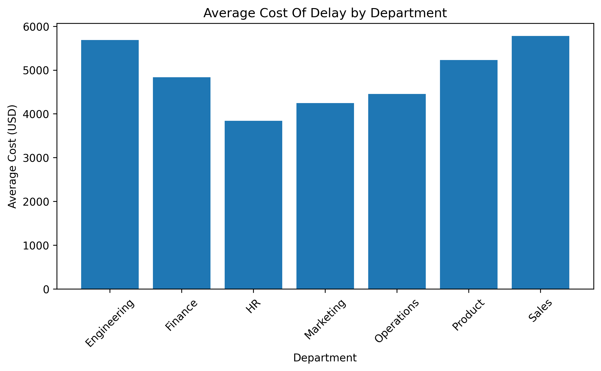
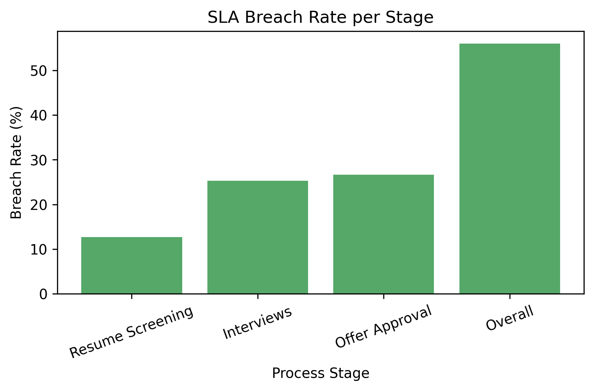
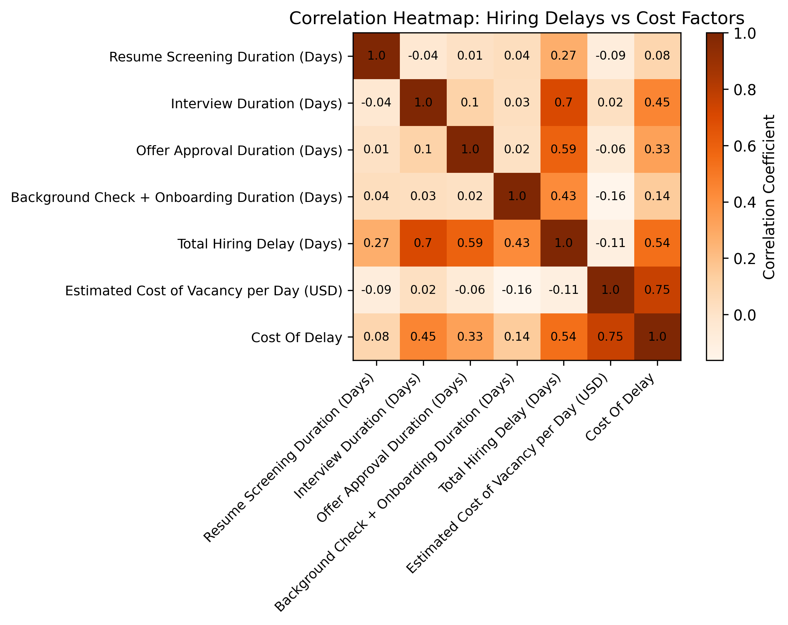

# Hiring Process Bottleneck Analysis - Quantifying Cost of Delays
> Self-initiated project exploring how hiring delays translate into real financial impact, quantifying decision bottlenecks across the talent pipeline.

## TL;DR
**Problem:** Hiring delays hide real financial losses, but are rarely quantified.

**Process:** Analyzed HR hiring workflow data to identify delay stages, SLA breaches, and the cost of vacancy across departments.

**Result:** Identified Offer Approval and Interviews as key bottlenecks; a 20% reduction in delays could save **$900-$1,200 per hire.**

## Table of Contents
- [Overview](#overview)
- [Key Questions Answered](#key-questions-answered)
- [KPIs Tracked](#kpis-tracked)
- [Visual Insights](#visual-insights)
- [Case Study Full Walkthrough](#case-study-full-walkthrough)
- [Interpretation & Business Impact](#interpretation--business-impact)
- [Recommended Actions](#recommended-actions)
- [Conclusion](#conclusion)
- [Optional Analysis: Scenario-Based Cost Sensitivity](#optional-analysis-scenario-based-cost-sensitivity)
- [Tools Used](#tools-used)
- [What This Project Demonstrates](#what-this-project-demonstrates)
- [Let's Connect](#lets-connect)

## Overview
This analysis explores how **hiring inefficiencies** contribute to lost productivity and rising costs. Using a synthetic dataset of HR process stages, I measured **time-to-fill, cost of vacancy**, and **SLA adherence** to uncover where decisions stall, and how much each delay costs in USD.

## Key Questions Answered
* Which departments experience the longest hiring delays?
* What's the average cost impact per day of delay?
* How often do SLAs get breached, and at which stage?
* How much could organizations save by improving process efficiency by 10-30%?

## KPIs Tracked
|Metric                     | Value                      |
|---------------------------|----------------------------|
|Average Total Hiring Delay |20.9 Days                   |
|Average Cost of Delay      |$4,835.22 per role          |
|SLA Breach Rate            |56% overall                 |
|Highest Delay Stage        |Offer Approval & Interviews |

## Visual Insights
**Cost of Delay by Department**

*Interpretation:* Sales and Engineering departments face the highest cost of delay, exceeding $5K per role. Operational roles also show above-average lag, suggesting approval dependencies.

**SLA Breach Distribution**

*Interpretation:* Over half the hiring requests exceed defined SLAs, with Offer Approval and Interviews being the biggest culprits.

**Correlation Heatmap**

*Interpretation:* Cost of delay shows the strongest correlation with **Estimated Cost of Vacancy per Day (0.75)** and **Total Hiring Delay (0.54)**, confirming that time inefficiency directly translates to financial loss.

## Case Study (Full Walkthrough)
For a deeper look at the analysis logic, segmentation methodology, and strategic recommendations, explore the full case study below: 
[View the full case study](https://docs.google.com/document/d/1ZDfiMZUW__Gul1wgNmBhXl8CgdCVM5ISgdzAGKFFHRE/edit?usp=sharing)

## Interpretation & Business Impact
* **Each day of hiring delay costs the company ~$4.8K.**
* **Offer Approval and Interview durations** are the biggest bottlenecks.
* Reducing overall delay by 20% could save **$900-$1,200 per role.
* Even small process optimizations like parallelizing approvals or automating scheduling can yield measurable ROI when scaled across multiple roles.

## Recommended Actions
* Implement parallel approval workflows for high-value roles
* Introduce SLA-based automated reminders for interview scheduling
* Track approval turnaround time as a performance metric
* Prioritize Sales & Engineering roles with fast-track hiring lanes

## Conclusion
Hiring delays aren't just operational issues; they're financial risks. More than half of roles miss SLA targets, and high-value departments like **Sales** and **Engineering** carry the highest costs. 
Reducing decision turnaround time doesn't just speed hiring; it protects company margins and improves candidate experience.

## Optional Analysis: Scenario-Based Cost Sensitivity
*Included to explore risk ranges; not required for core business conclusions.*

To explore uncertainty in real hiring timelines, I simulated 1,000 random hiring cycles using a Monte Carlo approach. Each iteration varied the total hiring delay by ±20% around the average of 21 days and recalculated the resulting cost of delay.

**Key Takeaways:** 
* Average simulated cost per hire ranged **$3.9K-$5.7K**.
* The "tail risk" (worst 10%) exceeded **$6K**, highlighting financial volatility.
* Faster approvals cut projected losses by up to **25%**.

*This simulation adds a probabilistic layer of HR analytics, showing that small process shifts don't just improve speed, they **de-risk the business.***

 ## Tools Used 
 * **Python (Pandas, Matplotlib):** Data cleaning, analysis, and impact simulation
 * **Excel:** Data verification & structure validation
 * **Jupyter Notebook:** Visualization and documentation

## What This Project Demonstrates
* Translating HR process delays into **financial impact**
* Identifying operational bottlenecks using SLA and time-to-fill metrics
* Supporting **process improvement decisions** with quantified insights
* Communicating findings through dashboards and clear business narratives

## Let's Connect
I'm building my career in data and HR analytics with a focus on understanding workplace dynamics through HR data. Feel free to reach out via:

* [GitHub](https://github.com/Shrey0561)
* [LinkedIn](https://www.linkedin.com/in/shreya-srinath-879a66205/)
* [Notion](https://www.notion.so/Data-Analyst-Portfolio-221ebe151fdd801e9445e32590b67758?source=copy_link)

I'm always up for conversations, mentorship, or entry-level opportunities.
